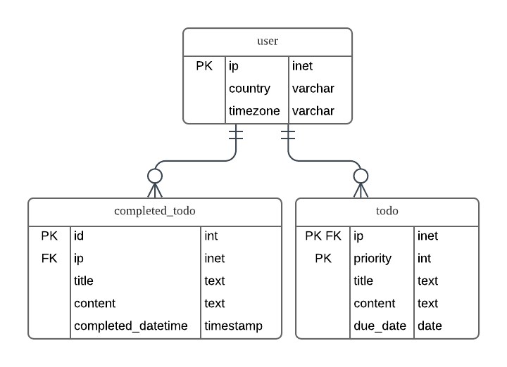

# Tech Stack
Python3, Flask, HTML, CSS, JavaScript, Materialize(Framework), Nginx, uWSGI, AWS EC2, Ubuntu, PostgreSQL

# Setting 
Your current path must be the path where app.py is.  
현재 경로는 반드시 app.py가 있는 경로여야한다.  
Let's say the app.py is in /home/todo.  
app.py가 /home/todo 존재한다고 하자.

## Installation
```
sudo su
cd /home/todo
apt install python3
apt install python3-pip
pip3 install flask pytz pygeoip uwsgi psycog2-binary psycopg2
apt-get install nginx
apt-get install postgresql postgresql-contrib
wget -N http://geolite.maxmind.com/download/geoip/database/GeoLiteCity.dat.gz
gunzip GeoLiteCity.dat.gz

```
## uWSGI Setting
```
1. vim uwsgi.ini

[uwsgi]
chdir = /home/todo
module = app
socket = /home/todo/todo.sock
chmod-socket = 666
daemonize = /home/todo/uwsgi.log
callable = app

2. vim wsgi.py

from app import app as application
if __name__ == "__main__":
    application.run()

3. uwsgi --socket 0.0.0.0:5000 --protocol=http -w wsgi

4. uwsgi uwsgi.ini
```

## Nginx Setting
```
1. vim /etc/nginx/sites-available/default

server{
    listen 5000;
    server_name xxx.xxx.xxx.xxx; <- protected server ip
    location /{
        include uwsgi_params;
        uwsgi_pass unix:/home/todo/todo.sock;
    }

}

2. service nginx start
```

# Database

## Tables

```
CREATE TABLE "user" ( 
    ip INET NOT NULL PRIMARY KEY, 
    country VARCHAR(100) NOT NULL,
    timezone VARCHAR(100) NOT NULL
);

CREATE TABLE "todo" ( 
    ip INET REFERENCES "user"(ip), 
    priority int NOT NULL, 
    title TEXT NOT NULL, 
    content TEXT NOT NULL, 
    due_date DATE NULL, 
    PRIMARY KEY(ip, priority)
);

CREATE TABLE "completed_todo" (
    id SERIAL PRIMARY KEY, 
    ip INET REFERENCES "user"(ip), 
    title TEXT NOT NULL, 
    content TEXT NOT NULL, 
    completed_datetime TIMESTAMP NOT NULL
);
```

## ER Diagram


## Stored Procedures
### 1. sp_select_user_info  
Get country and timezone of the input ```ip``` from the 'user' table
```
CREATE FUNCTION sp_select_user_info(
    p_ip INET) 
RETURNS TABLE(o_country VARCHAR, o_timezone VARCHAR) AS $$
BEGIN
    RETURN QUERY SELECT country, timezone FROM "user" WHERE ip = p_ip; 
END; 
$$ LANGUAGE plpgsql;
```

### 2. sp_insert_user_info  
Insert ip, country, and timezone into the 'user' table
```
CREATE FUNCTION sp_insert_user_info(
    p_ip INET,
    p_country VARCHAR,
    p_timezone VARCHAR) 
RETURNS void AS $$
BEGIN
    INSERT INTO "user"(ip, country, timezone) VALUES(p_ip, p_country, p_timezone); 
END; 
$$ LANGUAGE plpgsql;
```

### 3. sp_select_todos  
Get all todos from the 'todo' table
```
CREATE FUNCTION sp_select_todos( p_ip INET ) 
RETURNS TABLE(o_priority INT, o_title TEXT, o_content TEXT, o_due_date DATE) AS $$
BEGIN
    RETURN QUERY SELECT priority, title, content, due_date FROM "todo" WHERE ip = p_ip ORDER BY priority ASC; 
END; 
$$ LANGUAGE plpgsql;
```

### 4. sp_select_todo
Get a todo from the 'todo' table
```
CREATE FUNCTION sp_select_todo( 
    p_ip INET,
    p_priority INT ) 
RETURNS TABLE(o_title TEXT, o_content TEXT, o_due_date DATE) AS $$
BEGIN
    RETURN QUERY SELECT title, content, due_date FROM "todo" WHERE ip = p_ip AND priority = p_priority; 
END; 
$$ LANGUAGE plpgsql;
```

### 5. sp_insert_todo 
Insert new todo data into the 'todo' table
```
CREATE FUNCTION sp_insert_todo(
    p_ip INET,
    p_title TEXT,
    p_content TEXT) 
RETURNS void AS $$
DECLARE
    max_priority int;
BEGIN
    SELECT MAX(priority) INTO max_priority FROM "todo" WHERE ip = p_ip;
    IF max_priority IS NULL THEN
        INSERT INTO "todo"(ip, priority, title, content) VALUES(p_ip, 0, p_title, p_content);  
    ELSE
        INSERT INTO "todo"(ip, priority, title, content) VALUES(p_ip, max_priority + 1, p_title, p_content); 
    END IF;
END; 
$$ LANGUAGE plpgsql;
```

### 6. sp_remove_todo
Remove todo data from the 'todo' table and reorder the priorities
```
CREATE FUNCTION sp_remove_todo(
    p_ip INET,
    p_priority INT) 
RETURNS void AS $$
DECLARE
    count int;
    i int;
BEGIN
    i := p_priority;
    SELECT COUNT(*) INTO count FROM "todo" WHERE ip = p_ip;
    DELETE FROM "todo" WHERE ip = p_ip AND priority = p_priority;
    IF i <= count - 1 THEN
        LOOP
            IF i = count THEN
                DELETE FROM "todo" WHERE ip = p_ip AND priority = i - 1;
                EXIT;
            ELSE
                i := i + 1;
                UPDATE "todo" SET priority = i - 1 WHERE ip = p_ip AND priority = i; 
            END IF;
        END LOOP;   
    END IF;
END; 
$$ LANGUAGE plpgsql;
```

### 7. sp_update_todo 
Update todo data from the 'todo' table
```
CREATE FUNCTION sp_update_todo(
    p_ip INET,
    p_priority INT,
    p_title TEXT,
    p_content TEXT,
    p_due_date DATE) 
RETURNS void AS $$
BEGIN
    UPDATE "todo" SET title = p_title, content = p_content, due_date = p_due_date WHERE ip = p_ip AND priority = p_priority; 
END; 
$$ LANGUAGE plpgsql;
```

### 8. sp_increase_priority_todo 
Update todo data from the 'todo' table
```
CREATE FUNCTION sp_increase_priority_todo(
    p_ip INET,
    p_priority INT) 
RETURNS void AS $$
BEGIN
    UPDATE "todo" SET priority = -1 WHERE ip = p_ip AND priority = p_priority - 1; 
    UPDATE "todo" SET priority = p_priority - 1 WHERE ip = p_ip AND priority = p_priority; 
    UPDATE "todo" SET priority = p_priority WHERE ip = p_ip AND priority = - 1; 
END; 
$$ LANGUAGE plpgsql;
```

### 9. sp_decrease_priority_todo 
Update todo data from the 'todo' table
```
CREATE FUNCTION sp_decrease_priority_todo(
    p_ip INET,
    p_priority INT) 
RETURNS void AS $$
BEGIN
    UPDATE "todo" SET priority = -1 WHERE ip = p_ip AND priority = p_priority + 1; 
    UPDATE "todo" SET priority = p_priority + 1 WHERE ip = p_ip AND priority = p_priority; 
    UPDATE "todo" SET priority = p_priority WHERE ip = p_ip AND priority = - 1; 
END; 
$$ LANGUAGE plpgsql;
```

### 10. sp_completed_todo
Move todo data from the 'todo' table to the 'completed_todo' table and reorder the priorities
```
CREATE FUNCTION sp_completed_todo(
    p_ip INET,
    p_priority INT,
    p_completed_datetime TIMESTAMP) 
RETURNS void AS $$
DECLARE
    v_title text;
    v_content text;
    count int;
    i int;
BEGIN
    i := p_priority;
    SELECT COUNT(*) INTO count FROM "todo" WHERE ip = p_ip;
    SELECT title, content INTO v_title, v_content FROM "todo" WHERE ip = p_ip and priority = p_priority;
    DELETE FROM "todo" WHERE ip = p_ip AND priority = p_priority;
    IF i <= count - 1 THEN
        LOOP
            IF i = count THEN
                DELETE FROM "todo" WHERE ip = p_ip AND priority = i - 1;
                EXIT;
            ELSE
                i := i + 1;
                UPDATE "todo" SET priority = i - 1 WHERE ip = p_ip AND priority = i; 
            END IF;
        END LOOP;   
    END IF;
    INSERT INTO "completed_todo"(ip, title, content, completed_datetime) VALUES(p_ip, v_title, v_content, p_completed_datetime);
END; 
$$ LANGUAGE plpgsql;
```

### 11. sp_select_completed_todos  
Get all completed todos from the 'completed_todo' table
```
CREATE FUNCTION sp_select_completed_todos( p_ip INET ) 
RETURNS TABLE(o_title TEXT, o_content TEXT, o_completed_datetime TIMESTAMP) AS $$
BEGIN
    RETURN QUERY SELECT title, content, completed_datetime FROM "completed_todo" WHERE ip = p_ip ORDER BY id ASC; 
END; 
$$ LANGUAGE plpgsql;
```

# Resource
https://pythonhosted.org/pygeoip/pygeoip.const-pysrc.html